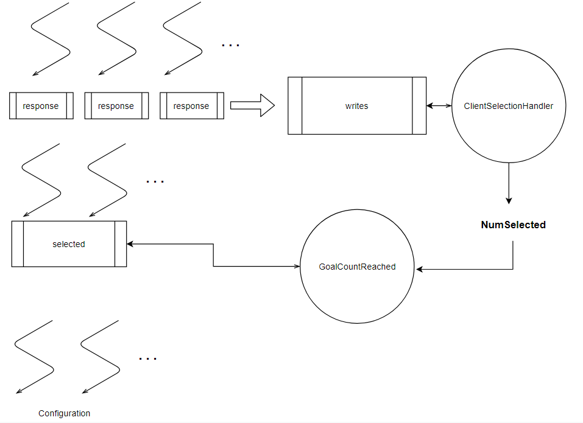

# Selector
Selector and Aggregator (SA) for the Federated Learning system

## Overview
Fl Selector has the following responsibilities
- Receive connections from the client willing to participate in an FL round
- Work with [Coordinator](https://github.com/fedota/fl-coordinator) to determine whether the required client count for starting the round has been reached.
- Send initial files required by the selected client to allow them to train the model 
- Aggregate the results sent by the client after they are done training and let the Coordinator know when the process completed

It has access to the following contents in the shared directory (more information: [fedota-infra](https://github.com/fedota/fedota-infra#shared-file-storage-structure))
```
\<fl-problem-id> 
	\initFiles
		fl_checkpoint <- R
		model.h5 <- R
		.
		.
	\<selector-id>
		fl_agg_checkpoint <- W
		fl_agg_checkpoint_weight <- W
		\roundFiles
			checkpoint_<client-no> <- WR
			checkpoint_weight_<client-no> <- WR
	.
	.
	.
```

### Workflow
- In the Selection stage, it receives connection request from client(handled by a separated go routine for each client). It notifies Coordinator of new connections to the Coordinator
- If the client is allowed to be selected (goal count has not reached) then it holds the connection and waits for Configuration stage to be started, otherwise it drops the client connection
- When the Coordinator notifies the selector to start configuration, it sends all files in `initFiles` directory to clients
- After clients complete training and begin to send updated checkpoint and weight(amount of data trained with), each client is assigned an index (client-no), without inconsistencies via ClientUpdateConnectionHandler, and the data is stored in `roundFiles` as shown above
- After all clients have reported, it run a mid level aggregation(federated averaging) and stores the result in `fl_agg_checkpoint` and `fl_agg_checkpoint_weight`
- It notifies the Coordinator that reporting/aggregation by it has been completed

Channel are used, as shown below, to make go-routines handling connection requests to wait for selection or wait till configuration begins. 

-Each grpc connection go routine creates a callback channel and sends it with other data to the writes channel (to increment client checkin count) and waits of its `response` channel. 
- Once Coordinator approves, the ClientSelectionHandler sends data the respective `response` channel to let the go-routine proceed. The handler also updates the total routines/clients selected
- Then the selected go-routines wait on the `selected` channel for start of configuration. 
- When the GoalCountReached message is received, it send messages (no equal to no of routines selected) on the `selected channel` to let the go-routine proceed with sending files to their respective clients. 



## Setup 
1. Compile protobuf needed in [fl-misc](https://github.com/fedota/fl-misc) by `fl-proto.sh` script
2. Build the docker image:
	`docker build -t fedota/fl-selector .`

- Run the container using:
`docker run --rm --name sel -p 50051:50051 -v /path/to/shared/dir:/data -v /path_to/config.yaml:/server_dir/config.yaml fedota/fl-selector` \
If running *fl-coordinator* and *fl-selector* locally replace `-p 50051:50051` with `--network="host"`\
For example, `docker run --rm --name sel --network="host" -v $PWD/../data:/data -v $PWD/config.yaml:/server_dir/config.yaml fedota/fl-selector` 

- To inspect the running container, open bash using:
`docker exec -t -i sel /bin/bash`

- To simply run and inspect a new container, execute:
`docker run -it fedota/fl-selector bash`

[Optional] Install go modules dependencies files by `go test`

## Resources
- Mark McGranaghan: https://gobyexample.com/stateful-goroutines